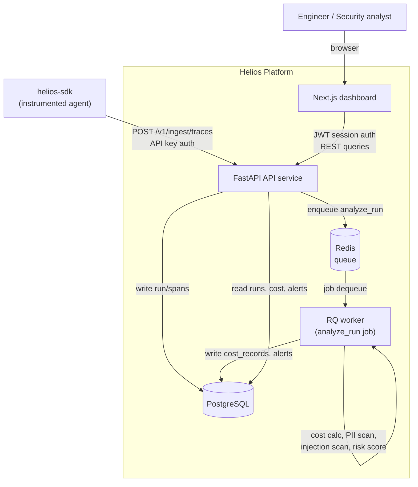
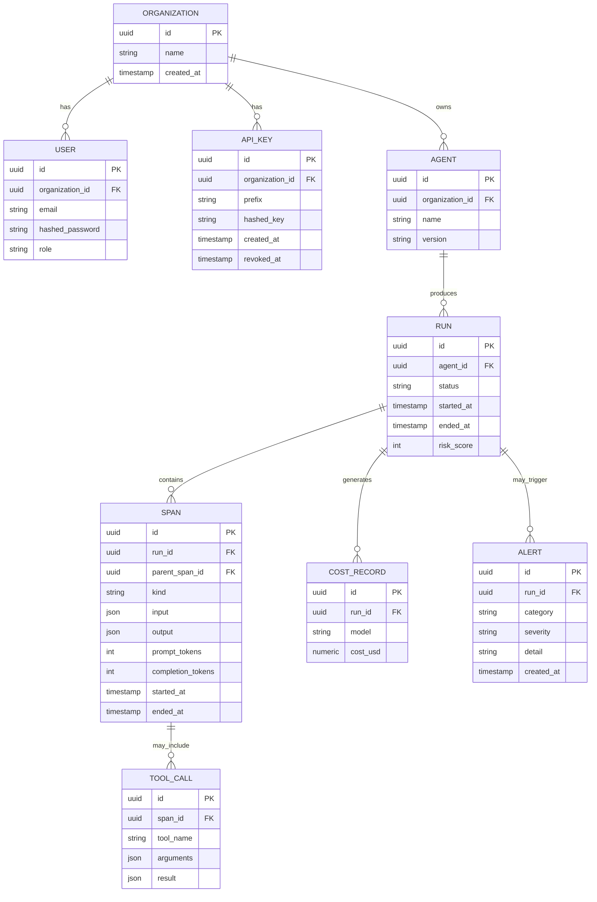

# Architecture: Helios

## System diagram

## Component responsibilities

| Component | Responsibility |
|---|---|
| `helios-sdk` | Python package agents import to send trace/span data to the ingestion endpoint with minimal integration code |
| API service | Auth, ingestion, dashboard REST API, OpenAPI docs |
| Worker | Async analysis: cost rollup, PII detection, prompt injection detection, risk scoring, alert generation |
| Web dashboard | Trace explorer, cost explorer, security alerts, agent health views |
| PostgreSQL | System of record for all entities |
| Redis | Job queue between API and worker |

## Entity relationship (core tables)

## Request flow: ingesting a trace

1. Instrumented agent calls `helios_client.log_run(...)` from `helios-sdk`.
2. SDK POSTs the run + spans to `/v1/ingest/traces` with its organization's API key.
3. API validates the key, persists `Run`/`Span`/`ToolCall` rows synchronously, returns 202 immediately.
4. API enqueues `analyze_run(run_id)` onto Redis.
5. Worker picks up the job: computes cost per span, runs PII/injection detectors over span input/output, computes a risk score, writes `CostRecord` and any `Alert` rows.
6. Dashboard queries reflect the enriched data on next poll/refetch.

## Deployment topology (v1)

Single-host Docker Compose: `api`, `worker`, `web`, `postgres`, `redis` containers on one Docker network, `web` and `api` exposed to the host. See the deployment guide in the root README once the scaffolding PR lands.
